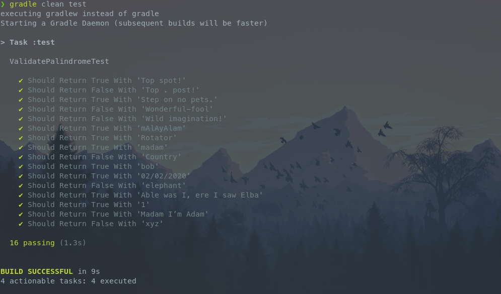

# Atividade TDD

Aula 1 "ESD21 - Automated Software Testing" - Atividade TDD

## Desafio

> Como usuário gostaria de uma funcionalidade que valide se uma frase ou palavra é
palíndromo.
Critérios de aceite:
Verdadeiro:
• “Rotator”
• “bob”
• “madam”
• “mAlAyAlam”
• “1”
• “Able was I, ere I saw Elba”
• “Madam I’m Adam”
• “Step on no pets.”
• “Top spot!”
• “02/02/2020”
Falso:
• “xyz”
• “elephant”
• “Country”
• “Top . post!”
• “Wonderful-fool”
• “Wild imagination!”

O componente deve receber os exemplos acima e retornar verdadeiro ou falso, conforme a
regra. Fazer o componente usando a metodologia TDD.
Enviar a URL do Github com todo o código fonte.
Fonte: https://en.wikipedia.org/wiki/Palindrome

## Como rodar os testes

```sh
git clone https://gitlab.com/luis-sena/mba/automated-software-testing/atividade-tdd.git && cd atividade-tdd

gradle clean test
```


